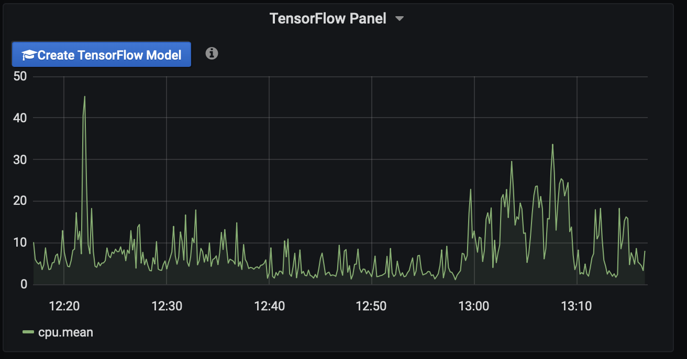

# TensorFlow graph panel for Grafana to create and train Machine Learning models

Grafana graph panel with TensorFlow models has a capability to create a train
ML models right in web-browser. No backend required. Panel uses TensoFlow JS - an open-source hardware-accelerated JavaScript library for training and deploying machine learning models.

# Workflow

 * Select data from your prefered datasource
 * Select TensorFlow graph as Visualization
 * Select data range to train/fit model on
 * Click "Create TensorFlow model" button
 * Enjoy :)
